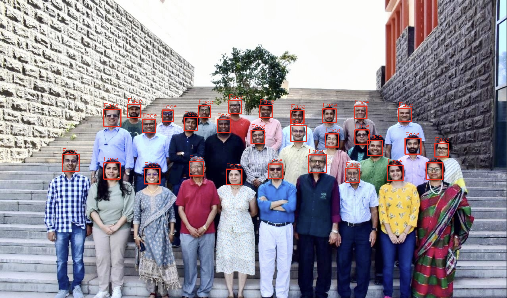

# Face Detection and Clustering – Distance-Based Classification

## Overview
- This project is part of a Machine Learning and Pattern Recognition assignment focusing on distance-based techniques and unsupervised learning. The goal is to detect faces in an image, extract meaningful features, cluster them using K-Means, and classify a template image based on similarity.
- The project demonstrates the integration of computer vision, feature engineering, clustering, and distance-based classification concepts.
## Objectives

- Detect faces using Haar Cascade classifiers.
- Extract HSV-based color features (Hue and Saturation).
- Apply K-Means clustering to group similar faces.
- Classify a template image into one of the clusters.
- Analyze distance-based classification concepts and evaluation principles.

## Features
- Implementation of face detection using OpenCV.
- Feature extraction using HSV color space.
- K-Means clustering with 3 clusters.
- Visualization of clusters and centroids.
- Template classification using trained clustering model.
- Discussion of distance metrics and model evaluation concepts.

## Technologies Used
- Python
- OpenCV
- NumPy
- Matplotlib
- Scikit-learn
- SciPy

## Methodology

### 1. Face Detection
- The image plaksha_Faculty.jpg is loaded.
- Converted to grayscale.
- Haar Cascade classifier is applied.
- Bounding boxes are drawn around detected faces.
### 2. Feature Extraction
- Faces are converted to HSV color space.
- Mean Hue and Mean Saturation values are computed.
- Each face is represented as a feature vector:
  [Hue, Saturation]
### 3. K-Means Clustering
- K-Means is applied with n_clusters = 3.
- Faces are grouped based on similarity in HSV feature space.
- Cluster centroids are calculated and visualized.
### 4. Template Classification
- Template image Dr_Shashi_Tharoor.jpg is processed similarly.
- HSV features are extracted.
- The trained K-Means model predicts the cluster label.
- The template is plotted along with clustered faces.
### 5. Visualizations
- The project includes the following visual outputs:
- Face detection with bounding boxes.
- Scatter plot of clustered faces.
- Centroid visualization.
- Template classification in HSV feature space.
  
### Example Markdown image format:

## Installation & Setup
- Clone the repository:
- git clone <repository_url>
- cd face_detection_clustering
  
- Install dependencies:
- pip install opencv-python numpy matplotlib scikit-learn scipy
- Run the script or notebook:
- jupyter notebook
- OR
- python main.py
- 
## Usage
- Ensure images are placed in the project directory.
- Run the script sequentially.
- Observe clustering visualization and template classification results.
- Modify number of clusters (k) to experiment with grouping behavior.
- Distance-Based Classification Concepts
  
## Common Distance Metrics
- Euclidean Distance
- Manhattan Distance
- Minkowski Distance
- Cosine Similarity
- These metrics measure similarity between feature vectors. Smaller distances indicate higher similarity.
  
## Real-World Applications
- Distance-based classification is widely used in:
- Handwritten digit recognition (e.g., MNIST)
- Medical diagnosis systems
- Recommendation systems
- Fraud detection
- Face recognition systems
- Model Evaluation Concepts
- Cross-Validation
- Helps estimate generalization performance.
- Reduces overfitting.
- Improves reliability of model evaluation.

## Bias and Variance in KNN
- Low K → Low bias, High variance (Overfitting)
- High K → High bias, Low variance (Underfitting)
- Optimal K balances bias and variance.
  
## Conclusion
- This project demonstrates how classical computer vision techniques combined with unsupervised learning can be applied to clustering and classification tasks.
- While HSV-based features are useful for simple clustering, robust real-world face recognition systems require advanced feature representations such as deep learning embeddings.
- The implementation successfully integrates:
- Image preprocessing
- Feature engineering
- Template-based classification
- Distance metric analysis

## Contact
For any queries or suggestions, reach out at [kuhuk.katiyar.ug24@plaksha.edu.in].

